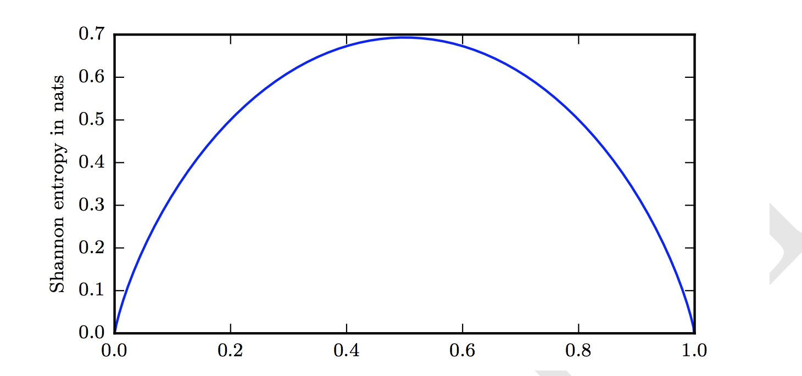

#《DEEP LEARNING》读书笔记 -- 2017年7月18日
* 3.10 Useful Properties of Common Functions
    * logistic sigmoid:    
 
    * 它常用来产生伯努利分布的参数$\phi$，因为它的范围为(0,1)；当它的值非常大或者非常小的时候，会变得饱和，当发生输入发生很小的变化时会变得不敏感。
    * softplus: $\zeta(x)=log(1+\rm{exp}(x))$
    
    * 它常用来产生正态分布的参数$\beta$和$\sigma$，因为它的范围在(0,$\infty$)；当处理包含sigmoid函数的表达式时它也经常出现。它是正部函数（ReLU）的平滑（或者软化）版本。
    * 正部函数（ReLU）: $x^{+}=\rm{max}\lbrace0,x\rbrace$，负部函数： $x^{-}=\rm{max}\lbrace0,-x\rbrace$
    * $\zeta(x)-\zeta(-x)=x$，$x^{+}-x^{-}=x$
* 3.11 Bayes' Rule
    * $P(x|y)=\frac{P(x)P(x|y)}{P(y)}$
* 3.12 Technical Details of Continuous Variables
    * 第一个技术细节是：measure theory对于我们的目的有两大作用，一是“measure zero”，用于描述对于庞大集合中一小部分极少的点集，例如二维空间中的一条直线，而我们在设计函数时，要避免仅适用于“measure zero”；二是“almost everywhere”，与“measure zero”相对，是除了“measure zero”的部分都成立。
    * 另一个技术细节是：涉及到处理那种相互之间有确定性函数关系 的连续型变量。例如：假设我们有两个随机变量x和y满足$y=g(x)$，其中g是可逆，可微的，就有人想到$P_{y}(y)=P_{x}(g^{-1}(y))$，实际上这是不对的。我需要保持下面的性质：
        [$|P_{y}(g(x))dy|=|P_{x}(x)dx|$]
        求解得到：
[$P_{y}(y)=P_{x}(g^{-1}(y))|\frac{\partial x}{\partial y}|$]
        而在高维空间，计算微分就用Jacobian矩阵
* 3.13 Information Theory
    * 必然发生的事件发生了或者不可能发生的事件没有发生是没有任何信息的，当一个很大可能发生却没有发生或者很小可能发生却发生了就会产生出大量的信息，因此我们基于这种思想来量化信息：
        * 非常可能发生的事件信息量要比较少，并且极端情况下，确保能够发生的事件 应该没有信息量。
        * 较不可能发生的事件具有更高的信息量。
        * 独立事件应具有增量的信息。例如，投掷的硬币两次正面朝上传递的信息量，应该是投掷一次硬币正面朝上的信息量的两倍。
    * 满足上面所有条件，我们称事件$\mathrm{x}=x$的self-information:
        [$I(x)=-logP(x)$]
        这里我们使用的是e为底的自然对数，单位定义为nets，与其他教材中的单位bits或者shannons是常数倍关系。
    * self-information只是单个信息的输出，我们量化整个概率分布用Shannon entropy：
        [$H(x)=\mathbb{E}_{x\sim P}\lbrack I(x) \rbrack  = - \mathbb{E}_{x\sim P}\lbrack logP(x)\rbrack$]
[]
越是不确定类型，其Shannon entropy越高，越确定类型，其Shannon entropy越低。
    * 对于两个都分布在同一个随机变量x的独立概率分布$P(x)$和$Q(x)$，我们用Kullback-Leibler (KL) divergence来量化其信息：
        [$D_{KL}(P||Q)=\mathbb{E}_{x\sim P}[log\frac{P(x)}{Q(x)}]=\mathbb{E}_{x\sim P}[logP(x)-logQ(x)]$]
        注意$D_{KL}(P||Q)\neq D_{KL}(Q||P)$，因为$D_{KL}(P||Q)$是Q拟合P高概率的部分，而$D_{KL}(Q||P)$是Q拟合P低概率部分
[]
* 3.14 Structured Probabilistic Models
    * 我们用图来表示概率的分解，这种方式称其为structured probabilistic model或者graphical model
    * 有向图：
        []
其公式为： $p(a,b,c,d,e)=p(a)p(b|a)p(c|a,b)p(d|b)p(e|c)$
    * 无向图：
        []
        其公式为：$p(a,b,c,d,e)=\frac{1}{Z}\phi^{1}(a,b,c)\phi^{2}(b,d)\phi^{3}(c,e)$
        $\phi^{i}(C^{i})$中$C^{i}$称其为clique，当$C^{i}$中每个条件都相互关联，而且$\phi^{i}$不属于任何的分布，因此所有$\phi^{i}$相加的值不要求等于1

