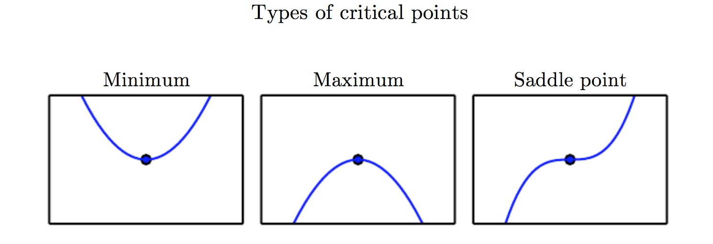

#《DEEP LEARNING》读书笔记 -- 2017年7月19日
* 4.1 Overflow and Underflow
    * 对于计算机而言，我们将要面临的一个问题是面对无限精度的实数，我们无法在有限资源的情况下对其进行表达，往往我们需要舍弃很多精度，这种操作叫做舍入误差(rounding error)
    * Overflow：当一个数接近$\infty$或者$-\infty$的时候，往往会超出计算机所能表达的精度，所以一般对于这种无限的值我们会用not-a-number来代替它。
    * Underflow：当一个十分接近0，但是不为0，由于精度的限制将其判断为0。
    * 在设计函数时，往往要考虑这个函数在计算机上是否会受到舍入误差这种问题，想softmax就是一个很好的例子：
        [$softmax=\frac{\mathrm{exp}(x_{i})}{\sum_{j=1}^{n}\mathrm{exp}(x_{j})}$]
        考虑到所有的$x_{i}$等于一个常数$c$，分析可以得到所有的输出都等于$\frac{1}{n}$。而且对所有的$x_{i}$加上同一个常数其结果是不会变的，所以利用这个性质，我们可以用$softmax(z)\;\mathrm{where}\;z=x-\mathrm{max}_{i}x_{i}$来替换softmax，这样的话既保证了分子不会出现Overflow的问题，有保证了分母中必定有1的存在，不会为0，一举两得。
        这里有个小问题就是那就是有可能出现Underflow的问题，在这里我可以使用$log\;softmax(x)$，但是先计算softmax，可能会因为分子为0，使得计算对数时会出现Overflow的问题，所以在这里，我们同样可以使用softmax的相应的策略来解决这问题（书上没有具体说明怎么操作，(╥﹏╥)）。
* 4.2 Poor Conditioning
    * 因为误差的存在，我们会使得输入发生改变，而这个改变可能会因为$f(x)=A^{-1}x$这种计算而放大，如何量化一个A在x发生很小变化时，$f(x)$的变化程度，这里我们定义condition number作为这个量化标准。
    * condition number：$max_{i,j}|\frac{\lambda_{i}}{\lambda_{j}}|$
    * 如果A是poor condition的，那么预先存在的误差就会被放大，这个误差很可能会影响到你后面的计算（误差会积累）
* 4.3 Gradient-Based Optimization
    * 大多数深度学习的优化算法，是通过改变$x$，使得$f(x)$向最大值或者最小值靠近，我们可以叫它objective function或者criterion。当它对其最小化的时候，我们可以称其为cost function，loss function或者error function。
    * 我们常用头标\*来表示：$x^{*}=arg\;min\;f(x)$
    * 一个函数的导数表示这个函数在当前这点上的斜率（就是当做一个很小的改变时，函数的变化程度），而这个函数的导数在最小化问题中是十分有作用的，它会告诉我们在如何改变$x$，来优化$f(x)$使其向最小值接近，对于一个足够小的$\epsilon$,使得$f(x-\epsilon \mathrm{sign}(f'(x)))$小于$f(x)$，这样一般般接近最小值，我们称这种方法叫gradient descent。
      []
    * 如果一个点使得$f'(x)=0$，我们称这个点为critical points或者stationary points。一个local minimum是一个点比周围的点都要低，一个local maximum是一个点比周围的点都要高，当时有种点既不是minimum，也不是maximum，这种点叫做saddle points。
      []
    * 如果一个点是整个$f(x)$中最低的那个点，则称其为global minimum，中点可能是一个，但有可能是多个。在深度学习中我们的优化函数可能含有很多不是最优的local minimum，也有可能有很多saddle points，尤其是多维输入下，所有一般我们的$f$找到的都不是global minimum，但也会是很小的local minimum。
      []
    * 我们通常都是将输入为多维的函数最小化为一维（标量）：$f:\mathbb{R}^{n}\to \mathbb{R}$
    * 在多维输入的时候我们很多时候会用到偏导数，而梯度是对于一个向量求导，其零界点是所有的偏导数都为0
    * directional derivative是指对于单位向量u进行求导。为了最小化f，我们需要找到一个方向使得f下降得最快，这里我们就可以利用directional derivative：
        [$\mathrm{min}_{u,u^{T}u=1}u^{T}\nabla_{X}f(x)=\mathrm{min}_{u,u^{T}u=1}||u||_{2}||\nabla_{X}f(x)||_{2}cos\theta$]
        这里，要使得上式最小，只有当$cos\theta=-1$时才会最小，而等于-1的方向便是与梯度方向完全相反的方向，这便是method of steepest descent或者gradient descent：
        [$x'=x-\epsilon\nabla_{x}f(x)$]
        这里的$\epsilon$我们叫做learning rate，通常我们会将其设计为一个常数，除此之外还有一种方法买就是通过几个$\epsilon$来计算$f(x-\epsilon\nabla_{x}f(x))$，得到的最小值作为函数的learning rate，这种策略被称之为line search。
    * steepest descent会收敛到每一个元素都为0为止（有时候是很接近0），有些情况我们可以直接接方程$\nabla_{x}f(x)=0\;for\;x$来一步跳到最优解
    * 这种方法还可以推广到离散空间，详细方法参考hill climbing（Russel and Norvig，2003）。
    * 4.3.1 Beyond the Gradient: Jacobian and Hessian Matrices
        * Jacobian matrixs：包含了所有输入输出都为向量函数的偏导数的矩阵
        * 如果一阶导数是原函数的斜率的话，那么二阶导数（second derivative）就是一阶导数的斜率，它会告诉我们一阶导数将如何变换，记作$f''(x)$，我们把其作用看做对曲率（curvature）的测量，虽然很多函数都不是二次的，但是至少可以在局部可以很好的近似为二次。如果二阶导为1，则下降$\epsilon$；如果为负，则一阶导是凹的，则下降比$\epsilon$要多；如果为正，则一阶导是凸的，则下降会比$\epsilon$要少。
      []
        * Hessian matrixs：就是包含了所有多维向量二阶导的矩阵：
        [$H(f)(x)_{i,j}=\frac{\partial^{2}}{\partial x_{i}\partial y_{i}}f(x)$]
        根据导数的性质不难看出它是一个对角矩阵，因此我们可以将其分解为一组实特征值和一组正交的实特征向量，其二阶导就可以写作$d^{T}Hd$。而方向二阶导数是所有特征值的加权平均， 权重在 0 和 1 之间，且与   夹角越小的特征向量的权重越大。最大特征值确定最 大二阶导数，最小特征值确定最小二阶导数。
        我们可以通过(方向)二阶导数预期一个梯度下降步骤能表现得多好。我们在$x^{(0)}$处进行二阶泰勒级数：
        [$f(x)\approx f(x^{(0)})+(x-x^{(0)})^{T}g+\frac{1}{2}(x-x^{(0)})^{T}H(x-x^{(0)})$]
        其中$g$是梯度，H是$x^{(0)}的$Hessian matrix，如果我们使用learning rate $\epsilon$，我们可以将$x$替换成$x^{(0)}-\epsilon g$，面可以得到：
        [$f(x^{(0)}-\epsilon g)\approx f(x^{(0)})-\epsilon g^{T}g+\frac{1}{2}\epsilon^{2}g^{T}Hg$]
        这里我们就可以看到曲率对下降的矫正，在实际过程中，泰勒级数不会在$\epsilon$大的时候也能保持准确，所以往往会采取启发式选择。其下降的最优步长是：
        [$\epsilon^{*}=\frac{g^{T}g}{g^{T}Hg}$]
最坏情况下，与最大特征值相关，取最优步长的$\frac{1}{\lambda_{\mathrm{max}}}$。
        * 当$f'(x)=0$且$f''(x)>0$时，x是个local minimum；当$f'(x)=0$且$f''(x)<0$时，x是个local maximum；当$f''(x)=0$时，是不确定的。
      []
        * 在很多情况下，当 Hessian 的条件数很差时，梯度下降法也会表现得很差，这是因为一个方向是导数增加的快，一个方向上导数增加的慢，而且在poor condition下，也很难找到合适的步伐。
      []
        * 我们可以使用Hessian matrix的信息来克服这个问题，这种方法叫Newton’s method：
        [$f(x)\approx f(x^{(0)})+(x-x^{(0)})^{T}\nabla_{x}f(x^{0})+\frac{1}{2}(x-x^{(0)})^{T}H(f)(x^{(0)})(x-x^{(0)})$]
        通过计算我们可以得到这个函数的临界点：
        [$x^{*}=x^{(0)}-H(f)(x^{(0)})^{-1}\nabla_{x}f(x^{0})$]
        迭代地更新近似函数和跳到近似函数的最小点可以比梯度下降更 快地到达临界点。这在接近局部极小点时是一个特别有用的性质，但是在鞍点附近 是有害的。这里我们将在8.2.3进行讨论。
        * 使用梯度信息的优化算法被称为first-order optimization algorithms；使用 Hessian maxtrix的优化算法被称为second-order optimization algorithms。
        * 在深度学习的背景下，限制函数满足Lipschitz continuous或者其导数满足Lipschitz continuous，Lipschitz continuous的函数公式为：
        [$\forall x,\forall y,|f(x)-f(y)|\leq \mathcal{L}||x-y||_{2}$]
        这个属性允许我们量化我们的假设——梯度下降等算法导致的输入的微小变化将使 输出只产生微小变化，因此是很有用的。Lipschitz continuous也是相当弱的约束，并 且深度学习中很多优化问题经过相对较小的修改后就能变得Lipschitz continuous。
        * 最成功的特定优化领域或许是convex optimization，其通过更强 的限制提供更多的保证。凸优化算法只对凸函数适用，即 Hessian 处处半正定的函数。因为这些函数没有鞍点而且其所有局部极小点必然是全局最小点，所以表现很好。然而，深度学习中的大多数问题都难以表示成凸优化的形式。凸优化仅用作一 些深度学习算法的子程序。凸优化中的分析思路对证明深度学习算法的收敛性非常有用，然而一般来说，深度学习背景下凸优化的重要性大大减少。详情见Boyd and Vandenberghe (2004) 或者Rockafellar (1997).

  

