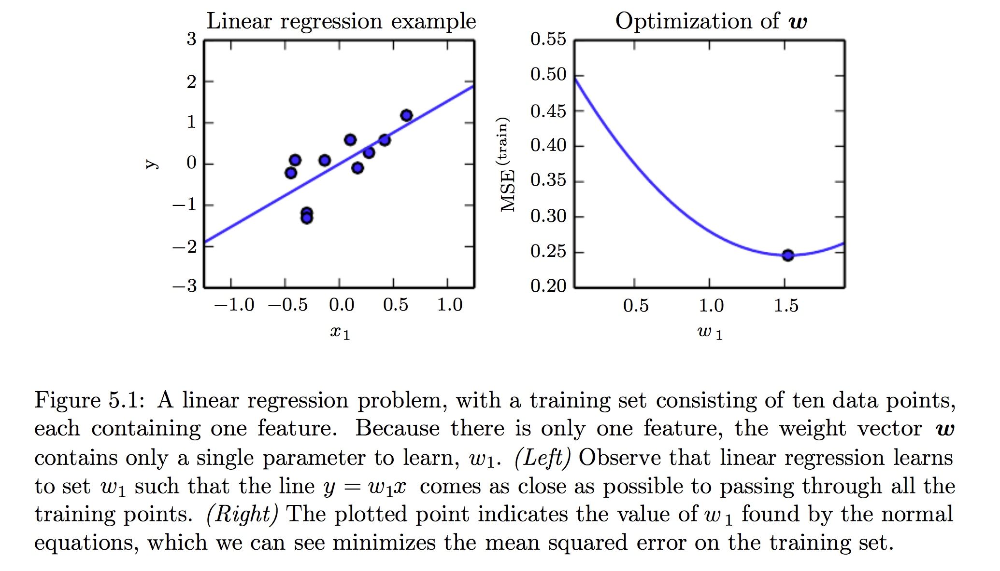

#《DEEP LEARNING》读书笔记 -- 2017年7月24日
* 5.1 Learning Algorithms(续)
    * 5.1.3The Experience, $E$
        * 根据算法在学习过程中经验的种类分为两种：unsupervised 和 supervised。
        * dataset：是由许多examples组成的集合，有时候我们称其example为data points.
        * Unsupervised learning algorithms：通过（经历，experience）一个拥有许多特征的dataset，学习其结构中有用的属性。在深度学习中，我们想要去学习整个被生成的（generated）dataset，显式（explicitly）的就像density estimation，隐式（implicitly）的synthesis或者denoising。一些其他Unsupervised learning algorithms会有不同的任务，比如clustering。
        * Unsupervised learning algorithms：通过（经历，experience）一个拥有许多特征的dataset，但是其dataset中每一个example都有一个相关的label或者target。
        * Unsupervised learning algorithms和Unsupervised learning algorithms不是严格定义的术语。它们之间界线通常是模糊的。很多机器学习技术可以用于这两个任务，例如：
            * $p(x)=\prod_{i=1}^{n}p(x_{i}|x_{1},\dots,x_{i-1})$ 将概率的链式法则表明对于向量$x\in \mathbb{R}^{n}$，联合分布可以分解成该式，意味着我们可以拆分为n个supervised的问题来解决。
            * $p(y|\mathrm{x})=\frac{p(\mathrm{x},y)}{\sum_{y^{'}}p(\mathrm{x},y^{'})}$，我们求解supervised问题$p(y|\mathrm{x})$时，也可以使用传统的unsupervised策略学习联合分布$p(\mathrm{x},y)$。
        * 学习范式的其他变种也是有可能的。例如semi-supervised learning（一些example有supervision target，但其他examples没有）。
        * 有些机器学习算法并不是训练于一个固定的数据集上。例如reinforcement learning（算法会和环境进行交互，所以学习系统和它的训练过程会有反馈回路）。
        * design matrix：通常用于描述一个dataset的方式。每一个example都能表示成向量，并且这些向量的大小相同，才能将一个数 据集表示成design matrix。这一点并非永远可能。
    * 5.1.4 Example: Linear Regression
        * 我们的目标是建立一个系统，将向量$x\in\mathbb{R}^{n}$作为输入，预测标量$y\in\mathbb{R}$作为输出。令$\hat{y}$为系统预测值：
            [$\hat{y}=w^{T}x$]
            其中$w\in\mathbb{R}^{n}$是parameters。我们可以将$w$看作是一组决定每个特征如何影响预测的weight。
            我们需要performance measure--$P$。用来评估性能的dataset叫test set，输入的design matrix记作$\mathrm{X}^{(test)}$，输出目标向量记作$\mathrm{y}^{(test)}$。
            度量模型性能的一种方法是计算模型在test set上的mean squared error：
            [$MSE_{test}=\frac{1}{m}\sum_{i}(\hat{y}^{(test)}-y^{(test)})$]
            或者
            [$MSE_{test}=\frac{1}{m}||\hat{y}^{(test)}-y^{(test)}||_{2}^{2}$]
            最小化$MSE_{train}$，我们可以简单地求解其导数为的情况:
            [$\nabla_{w}MSE_{train}=0$]
            [$\Rightarrow\;\nabla_{w}\frac{1}{m}||\hat{y}^{(train)}-y^{(train)}||_{2}^{2}=0$]
            [$\Rightarrow\;w=(X^{(train)T}X^{(train)})^{-1}X^{(train)T}y^{(train)}$]
            上述给出解的方程称之为normal equations。        
      []
            实际上inear regression会更加复杂：
            [$\hat{y}=w^{T}x+b$]
           截距项$b$通常被称为仿射变换的bias参数，这个术语的命名源自该变换的输出在没有任何输入时会偏移$b$。它和统计偏差中指代统计估计算法的某个量的期望估计偏离真实值的意思是不一样的。

            

            

            