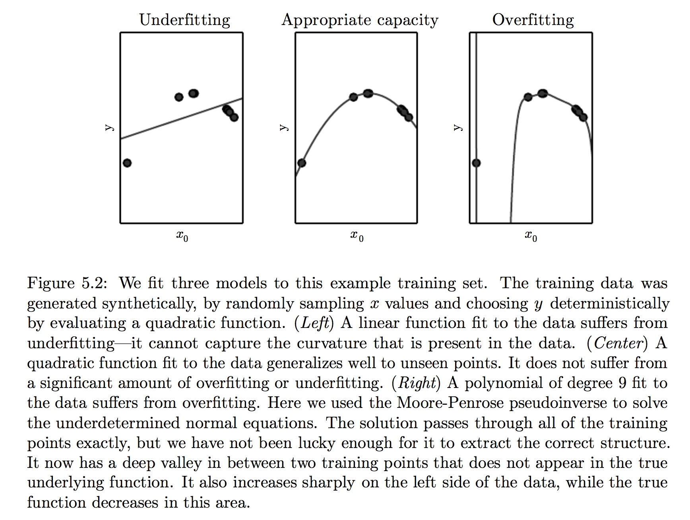
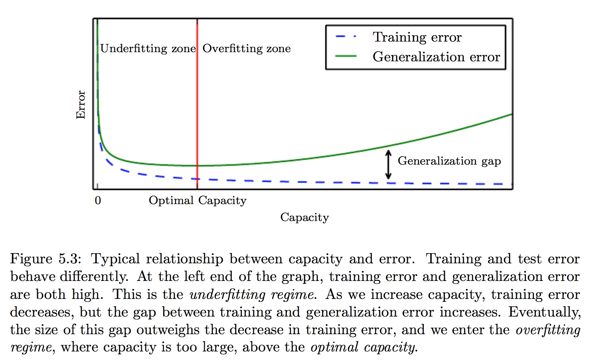
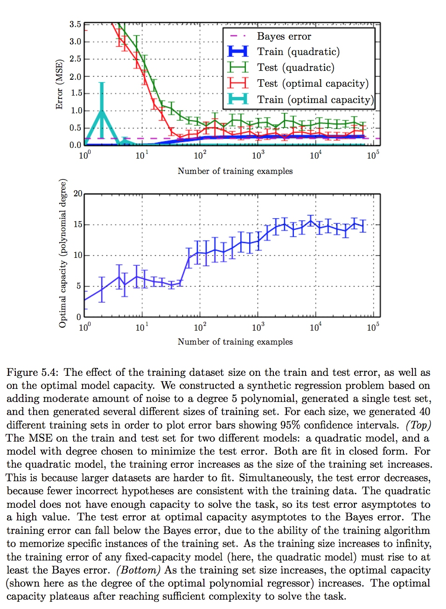

#《DEEP LEARNING》读书笔记 -- 2017年7月25日
* 5.2 Capacity, Overfitting and Underfitting
    * generalization：在以前为观察到的输入下表现很好的能力
    * training error：在train set上所测量出来的误差
    * generalization error(test error)：我们所期望的误差
    * 我们通过最小化training error来训练模型：
        [$\frac{1}{m^{(train)}}||X^{(train)}w-y^{(train)}||_{2}^{2}$]
        但我们真正关注的是test error：
        [$\frac{1}{m^{(test)}}||X^{(test)}w-y^{(test)}||_{2}^{2}$]
    * data generating process：测试集和训练集通过分部数据集的一个概率分布生成的过程
    * 我们假设每个dataset的examples之间相互independent，并且train set和test set都是相同的分布（i.i.d. assumptions）。这个假设允许我们描述data generating process的一个分布，而这个相同的分布可以生成任意的train set和test set。我们将这种分布叫做data generating distribution，记作$p_{data}$。然后我们就可以根据这个分布和i.i.d. assumptions来研究train error和test error的关系
           假设我们有一个概率分布$p(x,y)$和用它生成的train set和test set，我利用一个固定的连接权值$w$，期望training error与test error是一致的。它们唯一的不同就是名字不一样而已。
        在使用机器学习算法时，我们通过下降training error来下降test error，所有我们期望test error大于等于train error。如何评价一个机器学习算法的好坏，根据下面两点来看：
        1. 使training error变小
        2. 使得training error和test error之间差距变小
        这两个因素对应两大挑战：underfitting和overfitting。
    * underfitting：模型不能够从train set中获得满意的低error
    * overfitting：training error和test error之间差距太大
    * capacity：形容模型拟合函数的能力
    * hypothesis space：可以解决函数的解的选择空间的大小
    * 通过改变输入特征的数目和加入这些特征对应的参数，改变模型的capacity。
      []
        事实上，还有很多方法可以改变模型的capacity。capacity不仅取决于模型的选择。模型规定了调整参数降低训练目标时，学习算法可以从哪些函数族中选择函数。这种叫做模型的representational capacity。一些额外的因素会影响representational capacity，例如优化算法的不好，会使得模型的effective capacity小于representational capacity。
    * Occam’s razor：在多个可以解决当前问题的方案中选择最简单的一个。
    * Vapnik-Chervonenkis dimension(VC dimension)：衡量二元分类器的capacity，即该分类器能够分类的训练样本的最大数目。
    * 必须记住虽然更简单的函数更可能泛化(training error和test error的差距小)， 但我们仍然需要选择一个充分复杂的假设以达到低的training error。通常test error是一个U型函数。
      []
    * non-parametric模型:没有参数模型中参数是有限且固定的向量的限制。例如nearest neighbor regression，其返回的是距离最近点的类型。
    * Bayes error：从预先知道的真实分布$p(x,y)$预测而出现的误差。
    * 任何模型capacity小于最优capacity的固定参数模型会 渐近到大于Bayes error的误差值。具有最优capacity的模型仍然有可能在training error和test error之间存在很大的差距。在这种情况下，我们可以通过收集更多的训练examples来缩小差距。
    []