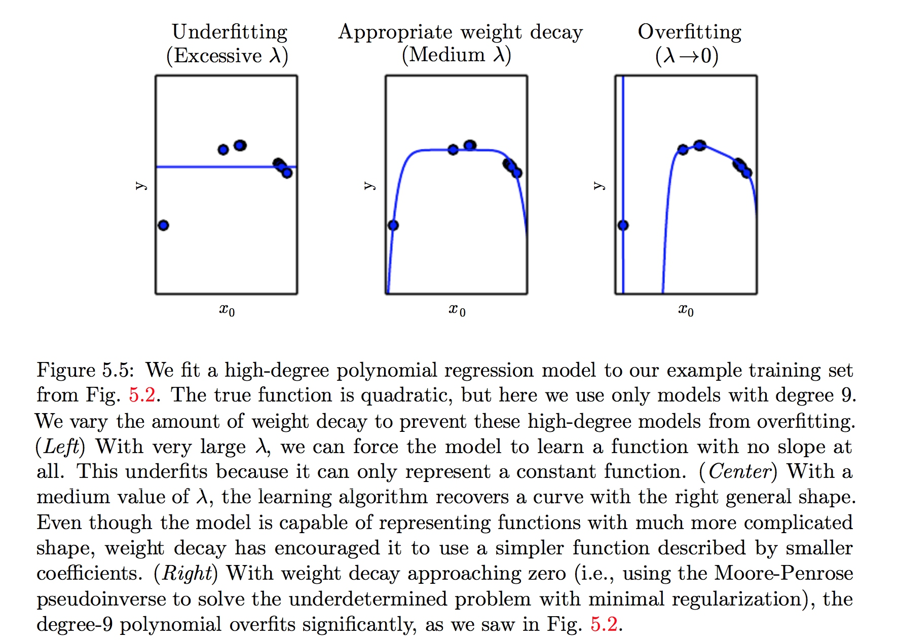

#《DEEP LEARNING》读书笔记 -- 2017年8月01日
* 5.2 Capacity, Overfitting and Underfitting（续）
    * 5.2.1 The No Free Lunch Theorem
        在所有可能数据的generating distributions上平均之后，每一个分类算法在未事先观测的点上都有相同的error rate。换言之，在某种意义上，没有一个机器学习算法总是比其他的要好。我们能够设想的最先进的算法和简单地将所有点归为同一类的简单算法有着相同的平均性能(在所有可能的任务上)。
        但是事实上，我们并非考虑在所有数据的generating distribution，而仅仅是考虑我们所观察到的数据的generating distribution，因此我们只需要设计我们所观察到的数据好的算法
    * 5.2.2 Regularization
        Regularization: 为了减小学习算法的generalization error，而添加的一个对于解的一种偏好。
        例如我们加入weight decay来修改linear regression的标准：
        [$J(w)=\mathrm{MSE_{train}}+\lambda w^{T}w$]
        $\lambda$是我们预先选好的值，用于控制我们对小权重的偏好，$\lambda$越大则对小权重的偏好越大。这会使得解决方案的斜率较小，或是将权重放在较少的特征上。
      []