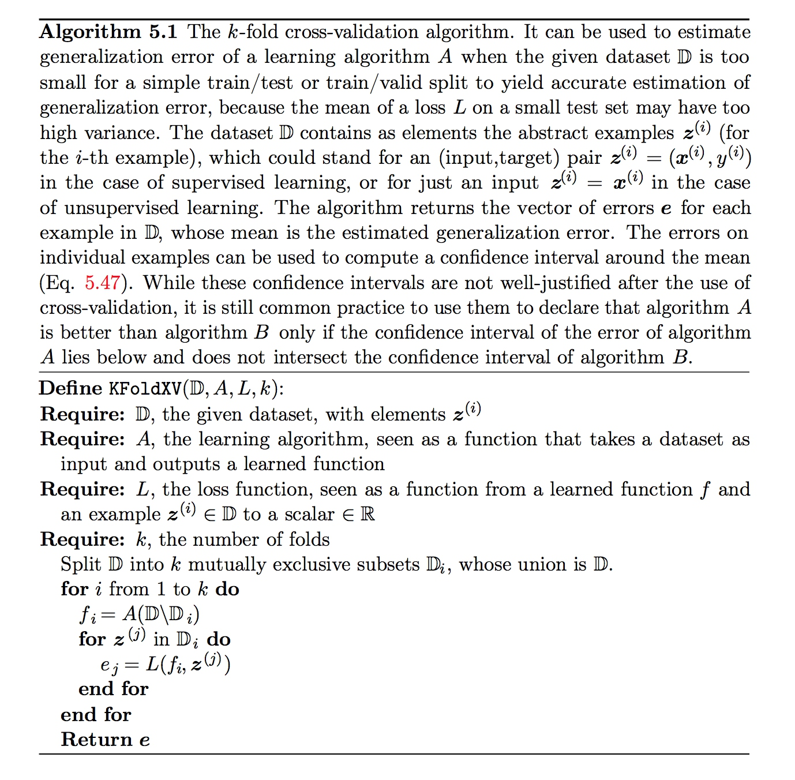

#《DEEP LEARNING》读书笔记 -- 2017年8月02日
* 5.3 Hyperparameters and Validation Sets
    * Hyperparameters:是指能够控制算法的行动，但是其值不能通过算法学习得来，而是需要人预先设定好的参数
    * Validation Sets：Hyperparameters是一个很难控制的参数，但是对于很多模型来说，是不得不有Hyperparameters，而其又不能够在training set中学习得到。对于那些Hyperparameters来控制模型capacity的模型，又因为数据集是我们预先不可观察的，所以我就需要从training set中随机分离一部分数据来作为Validation Sets，来评估模型的generalization error。
    * 5.3.1 Cross-Validation
        通常我们会把整个data set分为固定的training set和固定的test set，但是如果test set太小，就很导致我们估计test error会因为统计不完全使得一个算法在给定任务下优于另一个算法。
        而但数据很大的时候，这个问题将不是一个严重问题；当数据很小时也有替代方法允许我们使用所有的样本估计平均测试误差，代价是增加了计算量。这些过程是基于在原始数据上随机采样或分离出的不同数据集上重复训练和 测试的想法。最常见的便是Cross-Validation。将data set分为k份，每次用第i份来评价模型，评价k次然后算平均。带来的一个问题是存在平均误差方差的无偏估计。
    []
* 5.4 Estimators, Bias and Variance
    * 5.4.1 Point Estimation
        Point Estimation是指为兴趣量提供一种预测，而这个兴趣量一般是参数模型中的单个参数或者单个Vector，就像线性回归中的weights，但是也有可能是整个函数。
        我们通常将一个参数$\theta$的point estimate记作$\hat{\theta}$，一个 point estimator或者statistic的任意函数为：
        [$\hat{\theta}_{m}=g(x^{(1)},\dots,x^{(m)})$]
        我们不要求$g$的返回值接近$\theta$，也不要求返回一个所有允许$\theta$的集合。但是一个好的estimator的输出是接近training set真实的$\theta$
        真实的$\theta$是一个固定在，而$\hat{\theta}$却是来之于随机采来的数据，因此$\hat{\theta}$也是一个随机值
        Point estimation也可以指输入和目标变量之间关系的估计。我们将这种类型的点估计称为Function Estimation。
        Function Estimation：我们试图通过$x$去预测$y$。假设存在一个函数$f(x)$可以近似的描述$x$和$y$之间的关系。例如$y=f(x)+\epsilon$，其中$\epsilon$是从$x$中无法预测出y的那部分。在函数估计中，我们感兴趣的是用模型估计去近似$f$，或者估计$\hat{f}$。函数估计和估计参数$\theta$是一样的；函数估计$\hat{f}$是函数空间中的一个point estimation。